# 📧 Gmail Streamlit Client

A modern, feature-rich Gmail client built with Streamlit that allows users to view their inbox and send emails through a beautiful web interface.


---

## 📋 Table of Contents

- [Features](#-features)
- [High Level Design (HLD)](#-high-level-design-hld)
- [Authentication Methods](#-authentication-methods)
- [Project Structure](#-project-structure)
- [Setup & Installation](#-setup--installation)
- [Usage Guide](#-usage-guide)
- [Technical Details](#-technical-details)

---

## ✨ Features

| Feature | Description |
|---------|-------------|
| 📥 **View Inbox** | See recent emails with Gmail-like styling |
| ✏️ **Compose Email** | Send new emails with To, Subject, Body |
| ↩️ **Reply & Forward** | Quick reply/forward buttons on emails |
| 🔐 **Dual Authentication** | App Password + Google OAuth 2.0 |
| 🎨 **Gmail-like UI** | Avatar, timestamps, expandable emails |
| 🎉 **Animations** | Balloons on login, snowfall on refresh |

---

## 🏗️ High Level Design (HLD)

### System Architecture


### Component Diagram


---

## 🔐 Authentication Methods

### Google Authentication Options Comparison

| Method | Security | Setup Complexity | Use Case |
|--------|----------|------------------|----------|
| **Regular Password** | ❌ Blocked | N/A | Not allowed since 2022 |
| **App Password** ✅ | Medium | Easy | Personal use, testing |
| **OAuth 2.0** ✅ | High | Medium | Production apps |
| **Service Account** | High | Complex | Server-to-server |
| **API Key** | Low | Easy | Public data only |

### What We Use

This app supports **two authentication methods**:

#### 1️⃣ App Password (IMAP/SMTP)


**Pros:**
- Simple setup
- Works immediately
- No Google Cloud Console needed

**Cons:**
- User must generate App Password manually
- Password stored in session

---

#### 2️⃣ Google OAuth 2.0 (Gmail API)


**Pros:**
- Most secure method
- One-click login
- No password handling
- Can revoke access anytime

**Cons:**
- Requires Google Cloud Console setup
- Needs verification for public apps

---

## 📁 Project Structure

```
Gmail test/
├── 📄 app.py                  # Main Streamlit application
├── 📄 gmail_service.py        # IMAP/SMTP email operations
├── 📄 oauth_service.py        # Google OAuth & Gmail API
├── 📄 requirements.txt        # Python dependencies
├── 📄 README.md              # This file
└── 📁 .streamlit/
    ├── config.toml           # Streamlit theme (Gmail red)
    └── secrets.toml          # OAuth credentials (user adds)
```

### File Descriptions

| File | Purpose | Key Functions |
|------|---------|---------------|
| `app.py` | Main UI | `login_page()`, `inbox_page()`, `compose_page()` |
| `gmail_service.py` | IMAP/SMTP | `authenticate()`, `fetch_emails()`, `send_email()` |
| `oauth_service.py` | Gmail API | `get_authorization_url()`, `fetch_emails_oauth()` |

---

## 🚀 Setup & Installation

### Prerequisites

- Python 3.9 or higher
- Gmail account with 2-Step Verification enabled

### Installation

```bash
# Clone or navigate to project
cd "Gmail test"

# Install dependencies
pip install -r requirements.txt

# Run the app
streamlit run app.py
```

### Configuration

#### For App Password:
1. Go to [Google Account Security](https://myaccount.google.com/security)
2. Enable 2-Step Verification
3. Go to [App Passwords](https://myaccount.google.com/apppasswords)
4. Generate password for "Mail"
5. Use in the app

#### For OAuth 2.0:
1. Create project in [Google Cloud Console](https://console.cloud.google.com/)
2. Enable Gmail API
3. Configure OAuth consent screen
4. Create OAuth credentials
5. Add to `.streamlit/secrets.toml`:

```toml
[google_oauth]
client_id = "your-client-id.apps.googleusercontent.com"
client_secret = "your-client-secret"
```

---

## 📖 Usage Guide

### Login Flow

```mermaid
flowchart TD
    A[Open App] --> B{Choose Method}
    B -->|App Password| C[Enter Email + Password]
    B -->|Google OAuth| D[Click Sign in with Google]
    C --> E{Valid?}
    D --> F[Google Consent Screen]
    E -->|Yes| G[🎉 Welcome Animation]
    E -->|No| H[Show Error]
    F --> G
    G --> I[View Inbox]
```



### Features

1. **Login** - Choose App Password or Google OAuth
2. **Inbox** - Click email to expand and see full content
3. **Reply/Forward** - Quick buttons on each email
4. **Compose** - Write and send new emails
5. **Refresh** - ❄️ Snow animation while refreshing
6. **Logout** - Clear session and return to login

---

## 🔧 Technical Details

### Dependencies

```
streamlit>=1.28.0
imapclient>=2.3.1
google-auth>=2.25.0
google-auth-oauthlib>=1.2.0
google-api-python-client>=2.111.0
```

### API Scopes (OAuth)

```python
SCOPES = [
    'https://www.googleapis.com/auth/gmail.readonly',  # Read emails
    'https://www.googleapis.com/auth/gmail.send',       # Send emails
    'https://www.googleapis.com/auth/userinfo.email',   # Get user email
    'openid'                                            # OpenID Connect
]
```

### Ports Used

| Service | Port | Protocol |
|---------|------|----------|
| IMAP | 993 | SSL/TLS |
| SMTP | 587 | STARTTLS |
| Streamlit | 8501 | HTTP |

---

## 📸 Screenshots

The app includes:
- Gmail-style email cards with avatars
- Expandable emails with full message view
- Clean compose form
- Animated celebrations (balloons, snowfall)

---

## 🎉 Animations

| Action | Animation |
|--------|-----------|
| Login Success | 🎈 Balloons + Welcome toast |
| Inbox Refresh | ❄️ Snowfall effect |
| Email Sent | 🎈 Balloons celebration |

---

## 📝 License

This project is for educational purposes.

---

## 👨‍💻 Author

Built with ❤️ using Streamlit
